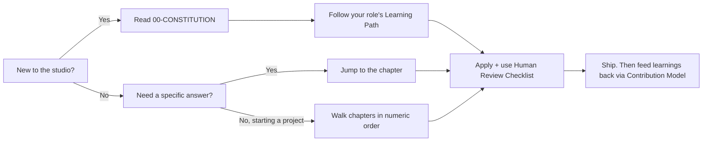
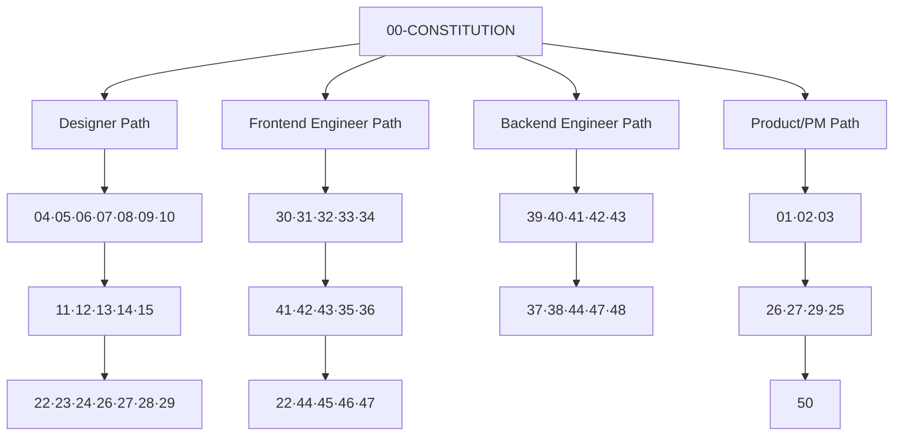
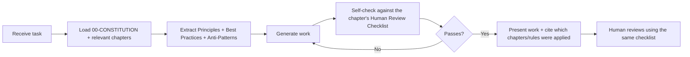
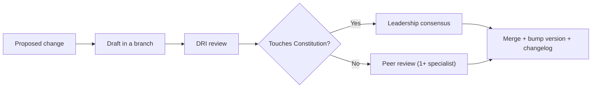

# The Studio Operating System

### An AI-First Software Design & Engineering Manual

> *"Systems beat individual pages. Consistency beats creativity. Every pixel must have a purpose, and every decision must be explainable."*

---

**Version:** 1.0.0 (Living Document)
**Status:** Active — continuously maintained
**Audience:** Designers, engineers, product managers, technical writers, and the AI agents that collaborate with them
**License of intent:** Internal operating handbook. Written to be adapted, forked, and evolved by any team that wants to build world-class software.

---

## Table of Contents

1. [What This Is](#1-what-this-is)
2. [Who This Is For](#2-who-this-is-for)
3. [How To Read This Manual](#3-how-to-read-this-manual)
4. [The Two Philosophies](#4-the-two-philosophies)
5. [Repository Structure](#5-repository-structure)
6. [The Chapter Contract](#6-the-chapter-contract)
7. [The Master Index](#7-the-master-index)
8. [Learning Paths](#8-learning-paths)
9. [How AI Agents Should Use This Manual](#9-how-ai-agents-should-use-this-manual)
10. [Quality Standard](#10-quality-standard)
11. [Conventions & Notation](#11-conventions--notation)
12. [Governance & Versioning](#12-governance--versioning)
13. [Contribution Model](#13-contribution-model)
14. [Glossary Starter](#14-glossary-starter)
15. [References for Further Study](#15-references-for-further-study)

---

## 1. What This Is

This repository is a **complete operating system for a software studio**. Not a website. Not a template. Not a style guide bolted onto a codebase. It is the **institutional memory** of an elite, multidisciplinary software company, written down so that it can be executed by humans *and* AI agents with equal fidelity.

It answers a single, hard question:

> **How does a team consistently ship software that is beautiful, fast, accessible, secure, maintainable, and delightful — every time, for the next decade?**

Most organizations answer this question implicitly. The knowledge lives in the heads of a few senior people. It evaporates when they leave. It fractures across Slack threads, Figma comments, and stale wiki pages. Quality becomes a lottery that depends on *who* happened to be in the room.

This manual makes that knowledge **explicit, versioned, and teachable**. It encodes the judgment of a Creative Director with 40 years of experience, a Principal React Engineer, an Accessibility Specialist, a Security Engineer, and 18 other world-class specialists — into documents that any team member (or agent) can read, apply, and be held accountable to.

### What it is NOT

- ❌ **A framework.** It recommends technologies (TypeScript, React, Next.js, Tailwind) but the *principles* are framework-agnostic. When React is replaced by something better in 2031, the reasoning survives.
- ❌ **A one-time deliverable.** It is a living document. Chapters are added and revised as the craft evolves.
- ❌ **Dogma.** Every rule includes its *rationale*. If you understand *why* a rule exists, you know when it is safe to break it.
- ❌ **A replacement for judgment.** It is scaffolding for judgment. It tells you which questions to ask, not merely which answers to accept.

---

## 2. Who This Is For

| Reader | What they get from this manual |
| --- | --- |
| **New engineer (Day 1)** | A single onboarding source. Read the Constitution, then your discipline's chapters. |
| **Senior engineer / architect** | Shared vocabulary and decision frameworks that make code review faster and design debates shorter. |
| **Designer** | A rigorous system for color, type, spacing, motion, and components — grounded in psychology and accessibility. |
| **Product manager** | The discovery, strategy, and information-architecture chapters that turn ambiguity into scoped work. |
| **Technical writer** | Copywriting, documentation, and tone standards. |
| **Engineering manager / lead** | Review rubrics, quality gates, and measurable criteria to hold work to a bar without micromanaging. |
| **AI agent** | Structured, machine-readable guidance — with explicit "AI Implementation Guidance" and "Human Review Checklist" sections in every chapter — so it can generate work that passes human review on the first try. |

---

## 3. How To Read This Manual

> **Want to use this with an AI builder (Trae AI, Claude, Cursor)?** Read [`HOW_TO_USE.md`](./HOW_TO_USE.md) for the plug-and-play workflow, and paste [`AI_RULES.md`](./AI_RULES.md) into your tool's standing instructions.

You do not need to read it front to back. Three access patterns:

1. **Onboarding path** — Read [`00-CONSTITUTION.md`](./00-CONSTITUTION.md) first, always. Then follow the [Learning Paths](#8-learning-paths) for your role.
2. **Reference path** — Jump directly to the chapter you need. Each chapter is self-contained and cross-links to its dependencies.
3. **Project path** — When starting a new project, walk the chapters in numeric order (Discovery → Strategy → Design → Engineering → Operations). The numbering *is* the default project lifecycle.



---

## 4. The Two Philosophies

Everything in this manual descends from two short creeds. They are repeated here because they are the axioms; the chapters are the theorems.

### 4.1 Design Philosophy

1. **Minimalism over clutter.** Remove until it breaks, then add one thing back.
2. **Hierarchy over decoration.** Guide the eye; don't ornament.
3. **Whitespace is a design feature**, not empty space to fill.
4. **Typography carries hierarchy.** Most problems are type problems.
5. **Motion guides attention.** It is a wayfinding tool, not a toy.
6. **Performance is part of design.** A slow interface is a broken design.
7. **Accessibility is mandatory**, never a phase-two "nice to have."
8. **Consistency beats creativity.** Novelty has a cost; spend it deliberately.
9. **Systems beat individual pages.** Design the machine, not the artifact.
10. **Reusable components over duplication.**
11. **User outcomes over visual effects.**
12. **Every pixel must have a purpose. Every animation must have intent. Every component must belong to one design system. Every design decision must be explainable.**

### 4.2 Engineering Philosophy

Prefer: **TypeScript · Next.js · React · Tailwind CSS · reusable architecture · Server Components where appropriate · accessibility-first · semantic HTML · performance-first · component-driven architecture · strict typing · scalable folder structures · reusable utilities, hooks, and UI components.**

And above all: **Never introduce unnecessary complexity.** The best code is the code you did not have to write. The second best is code so clear the next person (or agent) understands it without asking.

> These two creeds are expanded, defended, and operationalized in [`00-CONSTITUTION.md`](./00-CONSTITUTION.md).

---

## 5. Repository Structure

```
studio-os/
├── README.md                      ← you are here (map + index)
├── 00-CONSTITUTION.md             ← non-negotiable first principles
│
├── ── PHASE 1: DISCOVERY & STRATEGY ──
├── 01-PROJECT_DISCOVERY.md
├── 02-PRODUCT_STRATEGY.md
├── 03-BRAND_STRATEGY.md
│
├── ── PHASE 2: DESIGN FOUNDATIONS ──
├── 04-DESIGN_PHILOSOPHY.md
├── 05-VISUAL_PSYCHOLOGY.md
├── 06-COLOR_SYSTEM.md
├── 07-TYPOGRAPHY_SYSTEM.md
├── 08-SPACING_SYSTEM.md
├── 09-LAYOUT_SYSTEM.md
├── 10-GRID_SYSTEM.md
│
├── ── PHASE 3: COMPONENTS & TOKENS ──
├── 11-CARD_DESIGN.md
├── 12-BUTTON_DESIGN.md
├── 13-FORM_DESIGN.md
├── 14-COMPONENT_LIBRARY.md
├── 15-DESIGN_TOKENS.md
│
├── ── PHASE 4: PRODUCT SURFACES ──
├── 16-DASHBOARD_DESIGN.md
├── 17-LANDING_PAGE_DESIGN.md
├── 18-SAAS_DESIGN.md
├── 19-ECOMMERCE_DESIGN.md
├── 20-MOBILE_FIRST.md
├── 21-RESPONSIVE_DESIGN.md
│
├── ── PHASE 5: EXPERIENCE & INTERACTION ──
├── 22-ACCESSIBILITY.md
├── 23-MOTION_SYSTEM.md
├── 24-MICRO_INTERACTIONS.md
├── 25-COPYWRITING.md
├── 26-USER_EXPERIENCE.md
├── 27-INFORMATION_ARCHITECTURE.md
├── 28-WIREFRAMING.md
├── 29-USER_FLOWS.md
│
├── ── PHASE 6: ENGINEERING CRAFT ──
├── 30-REACT_GUIDE.md
├── 31-NEXTJS_GUIDE.md
├── 32-TYPESCRIPT_GUIDE.md
├── 33-TAILWIND_GUIDE.md
├── 34-FRAMER_MOTION_GUIDE.md
│
├── ── PHASE 7: QUALITY ATTRIBUTES ──
├── 35-PERFORMANCE.md
├── 36-SEO.md
├── 37-SECURITY.md
├── 38-AUTHENTICATION.md
│
├── ── PHASE 8: SYSTEMS & ARCHITECTURE ──
├── 39-DATABASE_DESIGN.md
├── 40-API_DESIGN.md
├── 41-CODE_ARCHITECTURE.md
├── 42-FOLDER_STRUCTURE.md
├── 43-CLEAN_CODE.md
│
├── ── PHASE 9: ASSURANCE & OPERATIONS ──
├── 44-TESTING.md
├── 45-QA.md
├── 46-CODE_REVIEW.md
├── 47-DEPLOYMENT.md
├── 48-MONITORING.md
├── 49-MAINTENANCE.md
├── 50-CONTINUOUS_IMPROVEMENT.md
│
├── ── EXTENDED CAPABILITIES ──
├── 51-REFERENCE_ANALYSIS.md       ← analyze any URL → structured teardown → style knowledge base
├── 52-DESIGN_OPS.md               ← scaling design as a governed, versioned system
├── 53-AI_COLLABORATION_PROTOCOL.md ← how humans + AI build together, accountably
├── 54-PROMPT_ENGINEERING.md       ← the craft of instructing AI well
├── 55-DATA_VISUALIZATION.md       ← honest, accessible charts
├── 56-INTERNATIONALIZATION.md     ← i18n/l10n: languages, scripts, RTL, cultures
├── 57-EMAIL_AND_NOTIFICATIONS.md  ← reaching users respectfully across channels
├── 58-ERROR_HANDLING_AND_RESILIENCE.md ← graceful degradation when things fail
├── 59-INCIDENT_RESPONSE.md        ← handling production emergencies + blameless learning
├── 60-ETHICS_AND_RESPONSIBLE_AI.md ← building software that deserves trust (capstone)
└── references/                    ← the living style knowledge base (grows over time)
    ├── README.md                  ← index + the "Any References?" protocol
    ├── _TEMPLATE.md               ← the 11-output teardown template
    └── <site>.md                  ← one teardown per analyzed site (e.g. linear-app.md)
```

> **Extended chapters (all complete):** ☑ `52-DESIGN_OPS`, ☑ `53-AI_COLLABORATION_PROTOCOL`, ☑ `54-PROMPT_ENGINEERING`, ☑ `55-DATA_VISUALIZATION`, ☑ `56-INTERNATIONALIZATION`, ☑ `57-EMAIL_AND_NOTIFICATIONS`, ☑ `58-ERROR_HANDLING_AND_RESILIENCE`, ☑ `59-INCIDENT_RESPONSE`, ☑ `60-ETHICS_AND_RESPONSIBLE_AI`. *(Production monitoring/observability is covered in [`48-MONITORING.md`](./48-MONITORING.md).)*

---

## 6. The Chapter Contract

Every chapter in this manual honors the same contract. This uniformity is deliberate: it lets a reader (or agent) predict exactly where to find what they need, and it forces each topic to be treated with the same rigor.

**Every chapter MUST contain these sections, in this order:**

| # | Section | What it delivers |
| --- | --- | --- |
| 1 | **Purpose** | Why this chapter exists and what problem it solves. |
| 2 | **Philosophy** | The worldview and first principles behind the topic. |
| 3 | **Principles** | The durable rules, each with its rationale. |
| 4 | **Best Practices** | Concrete, actionable, proven techniques. |
| 5 | **Anti-Patterns** | What to avoid and *why* it fails. |
| 6 | **Real-World Examples** | Worked examples with code/design artifacts. |
| 7 | **Common Mistakes** | The traps even experienced people fall into. |
| 8 | **AI Implementation Guidance** | How an AI agent should apply this chapter, including prompt patterns. |
| 9 | **Human Review Checklist** | The gate a human uses to approve the work. |
| 10 | **Automation Opportunities** | What can be linted, tested, generated, or CI-enforced. |
| 11 | **References for Further Study** | Where to go deeper (no copyrighted content reproduced). |

**Where appropriate, chapters also include:** Decision Trees · Checklists · Mermaid Flowcharts · Tables · Code Samples · Folder Structures · Naming Conventions · Design Tokens · Prompt Examples · Architecture Diagrams · Review Rubrics · Implementation Strategies · Migration Guides.

**Every chapter ENDS with:** a **Review Checklist** and **measurable quality criteria** so that "done" is never a matter of opinion.

---

## 7. The Master Index

> Links resolve as chapters are authored. A ☐ marks a chapter not yet written; ☑ marks a completed chapter.

### Foundation
- ☑ [`README.md`](./README.md) — Map, index, and rules of the manual *(this file)*
- ☑ [`00-CONSTITUTION.md`](./00-CONSTITUTION.md) — Non-negotiable first principles and the studio's value system

### Phase 1 — Discovery & Strategy
- ☑ [`01-PROJECT_DISCOVERY.md`](./01-PROJECT_DISCOVERY.md) — Turning ambiguity into scoped, evidence-based work
- ☑ [`02-PRODUCT_STRATEGY.md`](./02-PRODUCT_STRATEGY.md) — Positioning, roadmapping, and prioritization
- ☑ [`03-BRAND_STRATEGY.md`](./03-BRAND_STRATEGY.md) — Identity, voice, and the strategic role of brand

### Phase 2 — Design Foundations
- ☑ [`04-DESIGN_PHILOSOPHY.md`](./04-DESIGN_PHILOSOPHY.md) — The craft creed, expanded
- ☑ [`05-VISUAL_PSYCHOLOGY.md`](./05-VISUAL_PSYCHOLOGY.md) — Perception, cognition, and persuasion
- ☑ [`06-COLOR_SYSTEM.md`](./06-COLOR_SYSTEM.md) — Perceptual color, palettes, and contrast
- ☑ [`07-TYPOGRAPHY_SYSTEM.md`](./07-TYPOGRAPHY_SYSTEM.md) — Type scales, pairing, and rhythm
- ☑ [`08-SPACING_SYSTEM.md`](./08-SPACING_SYSTEM.md) — Spatial scales and density
- ☑ [`09-LAYOUT_SYSTEM.md`](./09-LAYOUT_SYSTEM.md) — Composition and structure
- ☑ [`10-GRID_SYSTEM.md`](./10-GRID_SYSTEM.md) — Grids, columns, and breakpoints

### Phase 3 — Components & Tokens
- ☑ [`11-CARD_DESIGN.md`](./11-CARD_DESIGN.md)
- ☑ [`12-BUTTON_DESIGN.md`](./12-BUTTON_DESIGN.md)
- ☑ [`13-FORM_DESIGN.md`](./13-FORM_DESIGN.md)
- ☑ [`14-COMPONENT_LIBRARY.md`](./14-COMPONENT_LIBRARY.md)
- ☑ [`15-DESIGN_TOKENS.md`](./15-DESIGN_TOKENS.md)

### Phase 4 — Product Surfaces
- ☑ [`16-DASHBOARD_DESIGN.md`](./16-DASHBOARD_DESIGN.md)
- ☑ [`17-LANDING_PAGE_DESIGN.md`](./17-LANDING_PAGE_DESIGN.md)
- ☑ [`18-SAAS_DESIGN.md`](./18-SAAS_DESIGN.md)
- ☑ [`19-ECOMMERCE_DESIGN.md`](./19-ECOMMERCE_DESIGN.md)
- ☑ [`20-MOBILE_FIRST.md`](./20-MOBILE_FIRST.md)
- ☑ [`21-RESPONSIVE_DESIGN.md`](./21-RESPONSIVE_DESIGN.md)

### Phase 5 — Experience & Interaction
- ☑ [`22-ACCESSIBILITY.md`](./22-ACCESSIBILITY.md)
- ☑ [`23-MOTION_SYSTEM.md`](./23-MOTION_SYSTEM.md)
- ☑ [`24-MICRO_INTERACTIONS.md`](./24-MICRO_INTERACTIONS.md)
- ☑ [`25-COPYWRITING.md`](./25-COPYWRITING.md)
- ☑ [`26-USER_EXPERIENCE.md`](./26-USER_EXPERIENCE.md)
- ☑ [`27-INFORMATION_ARCHITECTURE.md`](./27-INFORMATION_ARCHITECTURE.md)
- ☑ [`28-WIREFRAMING.md`](./28-WIREFRAMING.md)
- ☑ [`29-USER_FLOWS.md`](./29-USER_FLOWS.md)

### Phase 6 — Engineering Craft
- ☑ [`30-REACT_GUIDE.md`](./30-REACT_GUIDE.md)
- ☑ [`31-NEXTJS_GUIDE.md`](./31-NEXTJS_GUIDE.md)
- ☑ [`32-TYPESCRIPT_GUIDE.md`](./32-TYPESCRIPT_GUIDE.md)
- ☑ [`33-TAILWIND_GUIDE.md`](./33-TAILWIND_GUIDE.md)
- ☑ [`34-FRAMER_MOTION_GUIDE.md`](./34-FRAMER_MOTION_GUIDE.md)

### Phase 7 — Quality Attributes
- ☑ [`35-PERFORMANCE.md`](./35-PERFORMANCE.md)
- ☑ [`36-SEO.md`](./36-SEO.md)
- ☑ [`37-SECURITY.md`](./37-SECURITY.md)
- ☑ [`38-AUTHENTICATION.md`](./38-AUTHENTICATION.md)

### Phase 8 — Systems & Architecture
- ☑ [`39-DATABASE_DESIGN.md`](./39-DATABASE_DESIGN.md)
- ☑ [`40-API_DESIGN.md`](./40-API_DESIGN.md)
- ☑ [`41-CODE_ARCHITECTURE.md`](./41-CODE_ARCHITECTURE.md)
- ☑ [`42-FOLDER_STRUCTURE.md`](./42-FOLDER_STRUCTURE.md)
- ☑ [`43-CLEAN_CODE.md`](./43-CLEAN_CODE.md)

### Phase 9 — Assurance & Operations
- ☑ [`44-TESTING.md`](./44-TESTING.md)
- ☑ [`45-QA.md`](./45-QA.md)
- ☑ [`46-CODE_REVIEW.md`](./46-CODE_REVIEW.md)
- ☑ [`47-DEPLOYMENT.md`](./47-DEPLOYMENT.md)
- ☑ [`48-MONITORING.md`](./48-MONITORING.md)
- ☑ [`49-MAINTENANCE.md`](./49-MAINTENANCE.md)
- ☑ [`50-CONTINUOUS_IMPROVEMENT.md`](./50-CONTINUOUS_IMPROVEMENT.md)

### Extended Capabilities
- ☑ [`51-REFERENCE_ANALYSIS.md`](./51-REFERENCE_ANALYSIS.md) — Analyze any URL into a structured design teardown; build a compounding style knowledge base
- ☑ [`52-DESIGN_OPS.md`](./52-DESIGN_OPS.md) — Scaling design as a governed, versioned system (design↔code sync, contribution model)
- ☑ [`53-AI_COLLABORATION_PROTOCOL.md`](./53-AI_COLLABORATION_PROTOCOL.md) — How humans & AI build together, accountably (Article XI, operationalized)
- ☑ [`54-PROMPT_ENGINEERING.md`](./54-PROMPT_ENGINEERING.md) — The craft of instructing AI well (the studio delegation scaffold)
- ☑ [`55-DATA_VISUALIZATION.md`](./55-DATA_VISUALIZATION.md) — Honest, accessible, performant charts
- ☑ [`56-INTERNATIONALIZATION.md`](./56-INTERNATIONALIZATION.md) — i18n/l10n: languages, scripts, RTL, cultural adaptation
- ☑ [`57-EMAIL_AND_NOTIFICATIONS.md`](./57-EMAIL_AND_NOTIFICATIONS.md) — Respectful, deliverable, consented messaging across channels
- ☑ [`58-ERROR_HANDLING_AND_RESILIENCE.md`](./58-ERROR_HANDLING_AND_RESILIENCE.md) — Graceful degradation; fail like a trampoline
- ☑ [`59-INCIDENT_RESPONSE.md`](./59-INCIDENT_RESPONSE.md) — Calm production emergencies + blameless learning
- ☑ [`60-ETHICS_AND_RESPONSIBLE_AI.md`](./60-ETHICS_AND_RESPONSIBLE_AI.md) — Building software that deserves trust (the capstone)
- ☑ [`references/`](./references/README.md) — The living style knowledge base (index, template, and teardowns; e.g. [`linear-app.md`](./references/linear-app.md))

---

## 8. Learning Paths

Curated reading orders by role. Every path starts with the Constitution.



| Role | Recommended order |
| --- | --- |
| **Designer** | 00 → 04 → 05 → 06 → 07 → 08 → 09 → 10 → 11 → 12 → 13 → 14 → 15 → 22 → 23 → 24 → 25 → 26 → 27 → 28 → 29 |
| **Frontend Engineer** | 00 → 30 → 31 → 32 → 33 → 34 → 41 → 42 → 43 → 35 → 36 → 22 → 44 → 45 → 46 → 47 |
| **Backend Engineer** | 00 → 41 → 42 → 43 → 39 → 40 → 37 → 38 → 44 → 47 → 48 → 49 |
| **Product Manager** | 00 → 01 → 02 → 03 → 26 → 27 → 29 → 25 → 50 |
| **Design Systems Engineer** | 00 → 15 → 14 → 06 → 07 → 08 → 11 → 12 → 13 → 23 → 33 |
| **Full-Stack Generalist** | 00 → numeric order (01 → 50) |
| **Engineering Manager / Lead** | 00 → 46 → 45 → 44 → 50 → 41 → 35 → 37 |

---

## 9. How AI Agents Should Use This Manual

This manual is written to be executed by AI agents as well as humans. Agents are first-class citizens of the studio, and this section is their contract.

### 9.1 Operating loop



### 9.2 Rules for agents

1. **Constitution first.** Before any task, load [`00-CONSTITUTION.md`](./00-CONSTITUTION.md). Its rules override local convenience.
1a. **Ask for references before designing.** For any new visual/design surface, run the **"Any References?" protocol** ([`51-REFERENCE_ANALYSIS.md`](./51-REFERENCE_ANALYSIS.md) §7): ask the user for reference sites/styles to draw from or avoid, research your own exemplars, analyze new ones into the [`references/`](./references/README.md) knowledge base, then synthesize an **original** direction (never a clone) and get it approved before building.
2. **Cite your sources.** When producing work, state which chapters and principles you applied. Traceability is non-negotiable.
3. **Self-review before submission.** Run the target chapter's *Human Review Checklist* against your own output first. Report the results.
4. **Prefer the boring, proven path.** When two solutions are equal, choose the one that is more consistent with existing patterns in this manual.
5. **Surface trade-offs, don't hide them.** If a requirement conflicts with a principle, say so explicitly and propose options.
6. **Never invent facts.** If a chapter does not cover a case, say so and reason from first principles in the Constitution, flagging the gap for a human.
7. **Respect the Chapter Contract** when authoring or extending documentation.
8. **Small, reversible steps.** Prefer incremental, reviewable changes over large, opaque ones.

### 9.3 The standard prompt scaffold

When delegating to an agent, use this scaffold (chapters expand it with topic-specific variants):

```
ROLE: You are the {discipline} specialist of the studio.
CONTEXT: {project + relevant links to chapters}
TASK: {the specific, scoped deliverable}
CONSTRAINTS:
  - Follow 00-CONSTITUTION and {chapter numbers}.
  - Honor: accessibility (WCAG AA min), performance budget, strict typing.
DEFINITION OF DONE:
  - Passes the Human Review Checklist in {chapter}.
  - Includes measurable evidence (metrics, tests, contrast ratios, etc.).
OUTPUT FORMAT: {files / diff / doc}
SELF-REVIEW: Run the checklist and report pass/fail per item before finishing.
```

---

## 10. Quality Standard

**Assume every project will be showcased publicly.** That single assumption raises the floor. All output is evaluated against **twelve quality dimensions**:

| # | Dimension | Anchored by chapters |
| --- | --- | --- |
| 1 | **Visual Design** | 04–15 |
| 2 | **User Experience** | 26, 27, 28, 29 |
| 3 | **Accessibility** | 22 (WCAG AA/AAA) |
| 4 | **Performance** | 35 |
| 5 | **Maintainability** | 41, 42, 43 |
| 6 | **Scalability** | 39, 40, 41 |
| 7 | **Security** | 37, 38 |
| 8 | **SEO** | 36 |
| 9 | **Consistency** | 14, 15 |
| 10 | **Animation Quality** | 23, 24, 34 |
| 11 | **Code Quality** | 43, 44, 46 |
| 12 | **Developer Experience** | 30–34, 42 |

### The Studio Scorecard (0–4 per dimension)

| Score | Meaning |
| --- | --- |
| **0 — Absent** | Dimension ignored. Blocker. |
| **1 — Poor** | Present but below professional bar. Must fix before merge. |
| **2 — Acceptable** | Meets minimum. Ships, but tracked as debt. |
| **3 — Strong** | Professional quality. The default target. |
| **4 — Exemplary** | Showcase-worthy. Reference implementation for others. |

**Merge bar:** No dimension below **2**; team-weighted average **≥ 3.0**. Public showcase bar: no dimension below **3**.

---

## 11. Conventions & Notation

- **File naming:** `NN-TOPIC_NAME.md` — zero-padded two-digit prefix, `SCREAMING_SNAKE_CASE` topic. The prefix encodes lifecycle order.
- **Headings:** One `#` H1 per file (the chapter title). Sections use `##`; sub-sections `###`.
- **Callouts:** `>` blockquotes for principles and warnings.
- **Diagrams:** Mermaid fenced code blocks (```` ```mermaid ````). They render in GitHub, VS Code, and most viewers.
- **Code:** Fenced blocks with language hints (`ts`, `tsx`, `css`, `bash`, `json`).
- **Checkboxes:** `- [ ]` for actionable checklist items.
- **Emphasis of rules:** **Bold** for durable rules; *italics* for nuance.
- **Cross-references:** relative links, e.g. `[`22-ACCESSIBILITY.md`](./22-ACCESSIBILITY.md)`.
- **Semantic versioning of the manual:** `MAJOR.MINOR.PATCH` (see §12).
- **Tone:** Direct, evidence-based, and kind. We critique work, never people.

### Terminology precision

| Term | Meaning in this manual |
| --- | --- |
| **MUST / MUST NOT** | A hard rule. Violation blocks merge. |
| **SHOULD / SHOULD NOT** | A strong default. Deviation requires a written rationale. |
| **MAY** | Discretionary. Team or context decides. |
| **Principle** | A durable truth with a rationale. |
| **Pattern** | A reusable, named solution to a recurring problem. |
| **Anti-pattern** | A common solution that reliably causes harm. |

---

## 12. Governance & Versioning

The manual is a product. It has owners, a release process, and a changelog.

- **Ownership:** Each chapter has a **DRI** (Directly Responsible Individual) — usually the matching specialist. The DRI approves changes to their chapter.
- **Amendments to the Constitution** require consensus of the leadership group (Creative Director, Software Architect, and discipline leads). The Constitution changes rarely and deliberately.
- **Versioning scheme:**
  - **MAJOR** — A change that invalidates existing work or reverses a principle.
  - **MINOR** — A new chapter, or a substantive new section.
  - **PATCH** — Clarifications, typo fixes, example improvements.
- **Changelog:** Every release records what changed and why. History is never rewritten.
- **Review cadence:** Each chapter is revisited at least **every 6 months**, or immediately when the underlying technology shifts materially.



---

## 13. Contribution Model

Knowledge that stays in your head is a liability. The studio improves when learnings flow back into the manual.

**When to contribute:**
- You discovered a repeatable technique → add a Best Practice.
- You got burned by something → add an Anti-Pattern or Common Mistake.
- A tool changed → update the relevant guide and bump the version.
- A topic is missing → propose a new chapter (see the future-chapters list in §5).

**How to contribute:**
1. Open a change against the chapter, honoring the [Chapter Contract](#6-the-chapter-contract).
2. Provide *rationale and evidence*, not just opinion.
3. Get DRI + one peer review.
4. Update the version and changelog on merge.

**Definition of a good contribution:** It is specific, it is defensible, it includes a way to *verify* the guidance, and it makes the next person's job easier.

---

## 14. Glossary Starter

A minimal shared vocabulary. Each chapter extends it.

| Term | Definition |
| --- | --- |
| **Design token** | A named, platform-agnostic design decision (e.g. `color.brand.500`, `space.4`) stored as data. |
| **Component** | A reusable, self-contained UI or code unit with a defined contract (props/API). |
| **Server Component** | A React component that renders on the server and ships no client JS by default (Next.js App Router). |
| **Design system** | The single source of truth linking tokens, components, patterns, and usage guidance. |
| **Information architecture (IA)** | How content and functionality are structured, labeled, and related. |
| **WCAG AA/AAA** | Web Content Accessibility Guidelines conformance levels; AA is our minimum, AAA our aspiration. |
| **Core Web Vitals** | Google's user-centric performance metrics (LCP, INP, CLS). |
| **DRI** | Directly Responsible Individual — the single owner accountable for a chapter or decision. |
| **Performance budget** | A hard limit on a metric (e.g. JS ≤ 170KB gzipped) enforced in CI. |
| **Anti-pattern** | A widely used approach that reliably produces poor outcomes. |
| **Quality gate** | An automated or human checkpoint that work must pass to proceed. |

---

## 15. References for Further Study

*Pointers to bodies of knowledge, not reproductions of copyrighted content. Consult primary sources directly.*

- **Web standards & accessibility:** W3C (WCAG, WAI-ARIA Authoring Practices), MDN Web Docs.
- **Performance:** web.dev (Core Web Vitals), the Chrome/Lighthouse documentation.
- **Framework docs:** React, Next.js, TypeScript, and Tailwind CSS official documentation (treat these as the living source of truth over any snapshot in this manual).
- **Design systems:** Public design systems published by major technology companies serve as reference implementations to study — not to copy.
- **Typography & color science:** Foundational texts on typographic practice and perceptual color spaces (OKLCH/LCH) referenced per-chapter.
- **Software design:** Established literature on clean code, domain-driven design, refactoring, and systems architecture cited within the relevant chapters.

> Each chapter closes with its own precise, topic-specific references.

---

### Document Review Checklist

- [ ] The reader understands what this manual is and is not.
- [ ] The reader knows where to start (Constitution) and how to navigate (Learning Paths).
- [ ] The Chapter Contract is unambiguous and enforceable.
- [ ] The Master Index reflects the current state of the repository.
- [ ] AI-agent rules are explicit and actionable.
- [ ] The Quality Standard is measurable (Scorecard + merge bar defined).
- [ ] Governance, versioning, and contribution are defined.

### Measurable Quality Criteria

| Criterion | Target |
| --- | --- |
| Time for a new hire to find the right chapter | < 60 seconds |
| Chapters conforming to the Chapter Contract | 100% |
| Broken internal links | 0 |
| Chapters with a review cadence owner (DRI) | 100% |
| Average Studio Scorecard of shipped work | ≥ 3.0 |

---

*End of `README.md` — the entry point to The Studio Operating System.*
